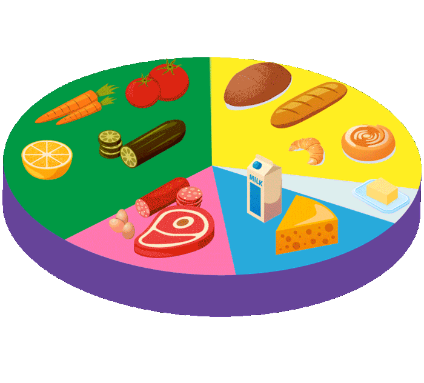
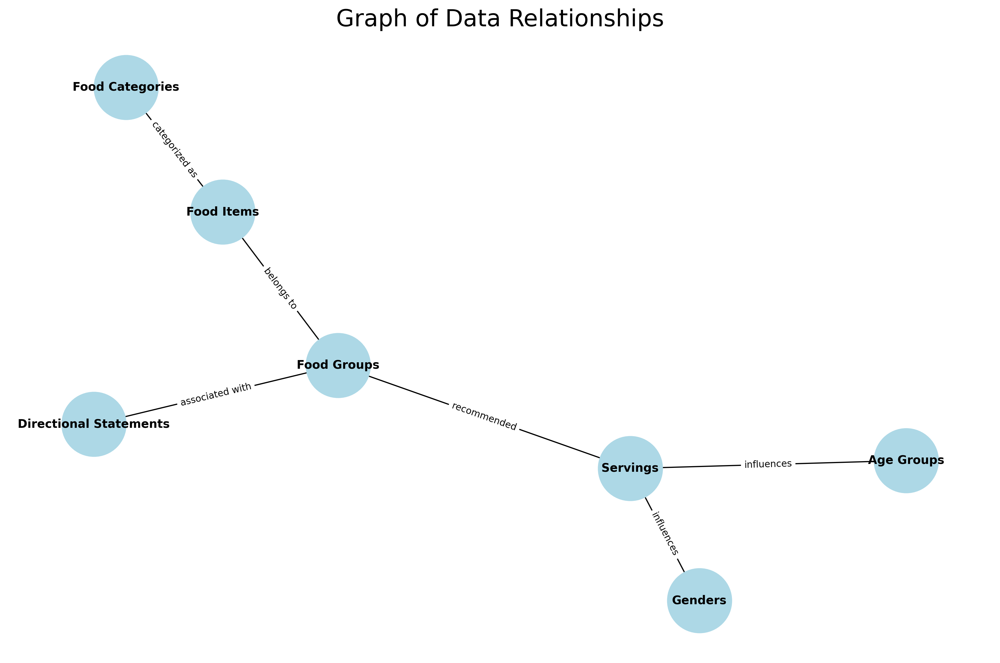

Data Analysis 
------
---

 Creating a food guide plan based on the provided data involves a few steps, including integrating the directional statements with specific food items and serving sizes to create practical dietary recommendations. Here’s how you can prepare a food guide plan using the data:   

- Step 1: Understand the Data: analyze the provided CSV files to understand how the food groups, serving sizes, and other related data are structured.    
- Step 2: Data Cleaning  
- Step 3: Mapping the Data: Map out how the food groups relate to different age groups and genders in terms of daily servings.    

🍽**Example of a 1-Day Meal Plan:**   
   Oatmeal (½ cup cooked) with a handful of blueberries and a glass of water. 
   Whole grain sandwich with lean turkey, lettuce, and tomato. Side of carrot sticks (½ cup). 
   Grilled salmon with ½ cup of steamed broccoli and ½ cup of quinoa. 
   1 medium apple and a handful of almonds. 
   
✅ This plan ensures that daily nutritional guidelines are met, with emphasis on whole foods and balanced portions as per the data provided
 
 

---  

   

**Here's a brief overview and initial analysis of structures:**
 

🔘**TABLE 1:** Directional Statements: Likely contains guidance or recommendations related to food groups or nutrition.  
**fgid:** Food group ID  
**vf**: Vegetables and Fruit  
**gr**: Grains  
**mi**: Milk and Alternatives  
**me**: Meat and Alternatives  

|  Food group | directional-statement|
|----------|----------|
| Vegetables and Fruit | Eat at least one dark green and one orange vegetable each day. | 
| Vegetables and Fruit | Choose vegetables and fruit prepared with little or no added fat, sugar, or salt | 
| Vegetables and Fruit | Have vegetables and fruit more often than juice |
| Grains | Make at least half of your grain products whole grain each day |
| Grains | Choose grain products that are lower in fat, sugar, or salt |
| Milk and Alternatives | Drink skim, 1%, or 2% milk each day. | 
| Milk and Alternatives | Select lower fat milk alternatives | 
| Meat and Alternatives | Eat at least two Food Guide Servings of fish each week |
| Meat and Alternatives | Select lean meat and alternatives prepared with little or no added fat or salt |

  

🔘**TABLE 2:** Appears to categorize various foods into groups, possibly relating to dietary guidelines.   
**foodgroup:** Name of the food group  
**fgcat_id:** Food group category ID  
**fgcat:** Description of the food group category

| fgid | foodgroup | fgcat_id | fgcat|
|----------|----------|----------|----------|
| vf | Vegetables and Fruit | 0 | Non dark green or orange vegetable |
| vf | Vegetables and Fruit | 1 | Dark green vegetable |
| vf | Vegetables and Fruit | 2 | Orange vegetable |
| gr | Grains | 4 | Non whole grain |
| gr | Grains | 3 | Whole grain |
| mi | Milk and Alternatives | 5 | Milk |
| mi | Milk and Alternatives | 6 | Milk Alternataives |
| me | Meat and Alternatives | 7 | Meat Alternatives |
| me | Meat and Alternatives | 8| Meat, fish, poultry and shellfish |

 
      
🔘**TABLE 3:** outlines recommended servings for different food groups per day.  
 
**srvg_sz:** Serving size description   

| fgid  | fgcat_id  | srvg_sz |Name of the food item  |
|----------|----------|----------|----------|
| vf | 0 | 21 samples like as(125 mL, ½ cup, 6 spears) | 50 foods  |
| vf | 1 | 8 samples like as(125 mL, ½ cup )| 21 foods  |
| vf | 2 | 2 samples like as(mL, ½ cup cooked ) | 5 foods |
| gr | ‼️1 | 1 samples like as(125 mL, ½ cup) | 1 foods|
| gr | 3 | 19 samples like as(125 mL, ½ cup) | 19 foods |
| gr | 4 | 19 samples like as(125 mL, ½ cup, 6 spears) | 19 foods |
| mi | 5 | 4 samples like as(125 mL, ½ cup) | 6 foods |
| mi | 6 | 4 samples like as(125 mL, ½ cup cooked ) |8 foods |
| me | 7 | 5 samples like as(125 mL, ½ cup )| 7 foods |
| me | 8 | 1 samples like as(125 mL, ½ cup) | 18 foods |
   
‼️fgcat_id of two vf & gr fgid is similar.   

🔘**TABLE4:**
Nutritional Intake Analysis by Gender and Age Group: A Comprehensive Study of Food Group Consumption and Serving Patterns  

| Gender | Age | vf |gr | mi | me |
|----------|----------|----------|----------|----------|----------|
| Female | 2 to 3 | 4 | 3 | 2 | 1 |
| Female | 4 to 8 | 5 | 4 | 2 | 1 |
| Female | 9 to 13 | 6 | 6 | 3 to 4 | 1 to 2 |
| Female | 14 to 18 | 7 | 6 | 3 to 4| 1 to 2 |
| Female | 19 to 30 | 7 to 8 | 6 to 7 | 2 | 2 |
| Female | 31 to 50 | 7 to 8 | 6 to 7 | 2 | 2 |
| Female | 51 to 70 | 7 | 6 | 3 | 2 |
| Female | 71+ | 7| 6 | 3 | 2 |
| Male | 2 to 3 | 4 | 3 | 2 | 1 |
| Male | 4 to 8 | 5 | 4 | 2 | 1 |
| Male | 9 to 13 | 6 | 6 | 3 to 4 | 1 to 2 |
| Male | 14 to 18 | 8 | 7 | 3 to 4| 3 |
| Male | 19 to 30 | 8 to 10 | 8 | 2 | 2 |
| Male | 31 to 50 | 8 to 10 | 8 | 2 | 3 |
| Male | 51 to 70 | 7 | 7 | 3 | 3 |
| Male | 71+ | 7| 7 | 3 | 3 |

---
  

    **Table relationship diagram**  

The diagram illustrates the relationships between different tables related to food and demographic data. This analysis was conducted using Python. Here’s a breakdown of the relationships:

- Food Groups are central to the diagram, showing their connection to various other entities.
- Food Items are linked to Food Groups, indicating that each food item belongs to a specific food group.
- Food Categories are associated with Food Items, categorizing these items based on broader criteria.
- Directional Statements are connected to Food Groups, representing guidelines or recommendations associated with each food group.
- Servings are linked to Food Groups, indicating the recommended number of servings for each group.
- Genders and Age Groups are connected to Servings, showing that the recommended servings can vary depending on the gender and age group of individuals. 

 

