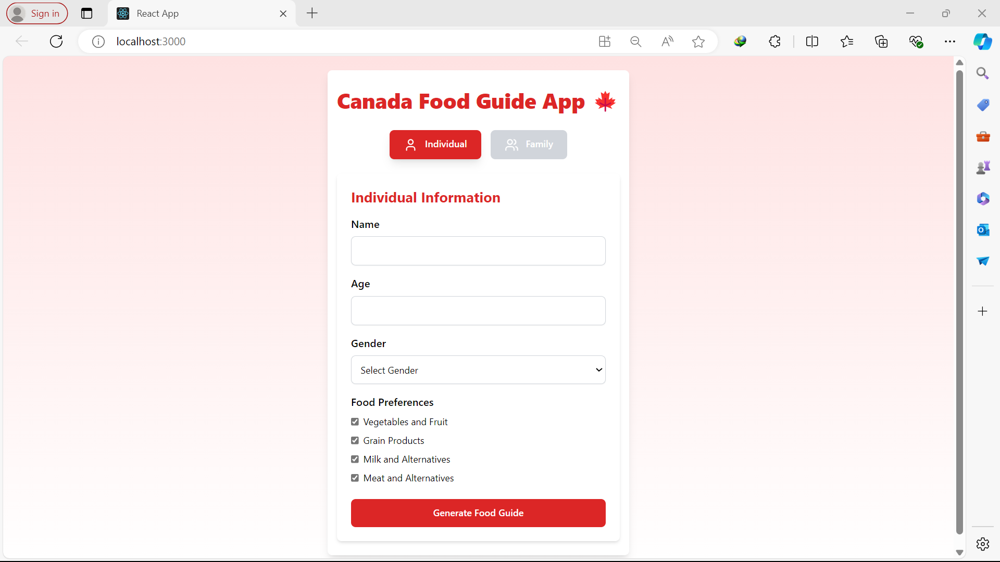
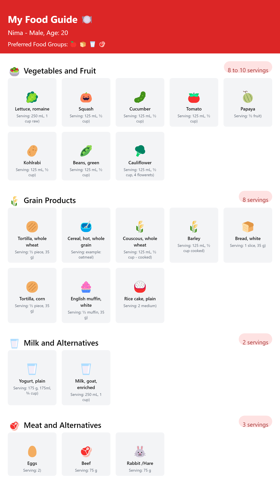
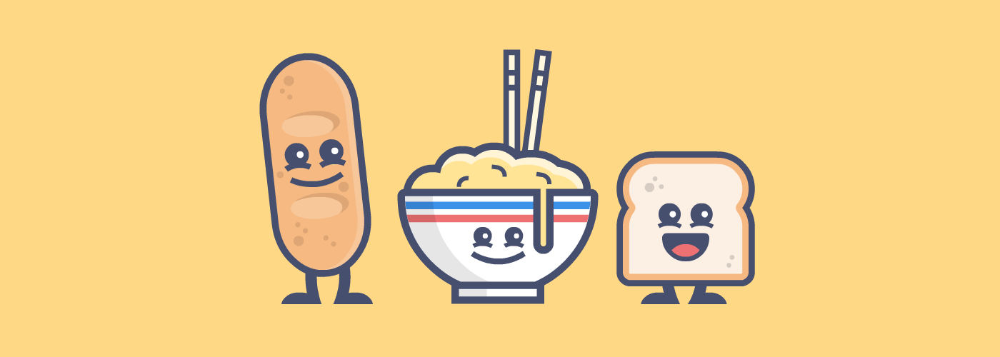

 #  Canada Food Guide App  
    

## Introduction

 This app should allow users to input their age and gender, then generate a personalized daily food plan based on these inputs. Here's how it should work:  
 
- **User Input:** The user enters their age and selects their gender.  
- **Data Processing:** The app uses the provided data and generates a daily food plan, suggesting specific foods and their serving sizes from different food groups (like fruits, vegetables, proteins, etc.). 
- **Output Display:** The app displays the personalized daily plan, showing the recommended foods and portion sizes for each meal.  
This app aims to help users plan their meals in a healthy and balanced way according to dietary guidelines.
  
## Demo  
live demo : http://194.146.123.54:3000/

##
 

   
- **Personalized food plan**
 
 

 

## Built With
React - Javascript Library for creating UI  
Tailwind CSS  
React Hooks

Getting Started
---

    npm install  
    npm start

 

 

  

<code>Healthy meals start with planning</code>

 
