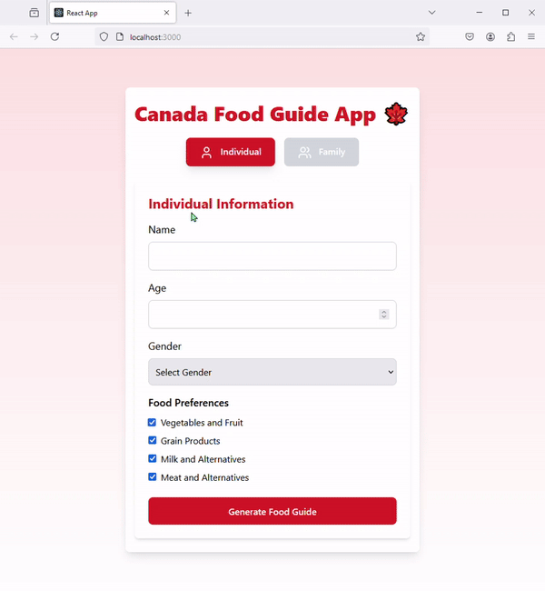
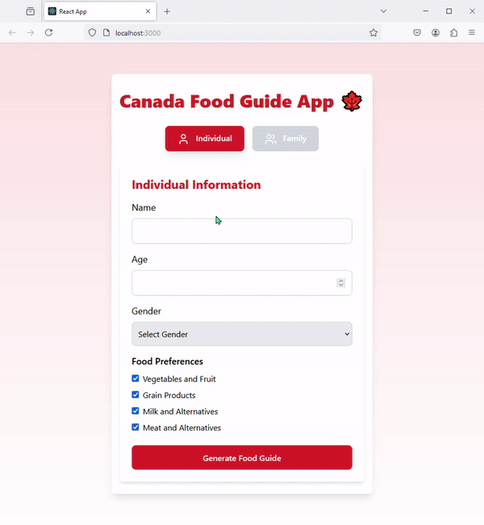

## Canada's Food Guide react

 

The project initially started with a basic implementation using HTML and CSS to create a static design. After that, React was integrated to add the required features and functionalities. 

First step:
Create the basic structure using HTML entities. Using CSS styling properties, style the components with CSS properties like display, color, font size, margin, padding, and border. 
 [Canada Food Guide - HTML](https://fateme-sadouni.github.io/Food-Guide/)
 

⏭In the next phase of the project, additional features were implemented using React, significantly improving both functionality and user experience. 
     
 
---

  

React Development  | Version 1 | Demo
---
   

  

**To Do**
 
 - [ ] UI improvements  
 - [ ] Updated displayed information and adjusted random data 
 - [ ] Component-based architecture  
 
 
---

React Development | Version 2 | Demo
---
   

  

**To Do**
 
- [ ] Component-based architecture  
 
---

  
React Development  | Version 3 
---
   

- [x] Component-Based Design: The project was restructured into smaller, reusable React components, making the code easier to manage and extend.

---

  
React Development  | Version 4 
---  
 

- [ ] it is recommended to define the CSS and other elements as separate components. React's component-based architecture allows multiple developers to work on different components simultaneously without causing disruptions. This parallel development streamlines project timelines and provides lifecycle methods that allow you to control the rendering behavior of components. 
